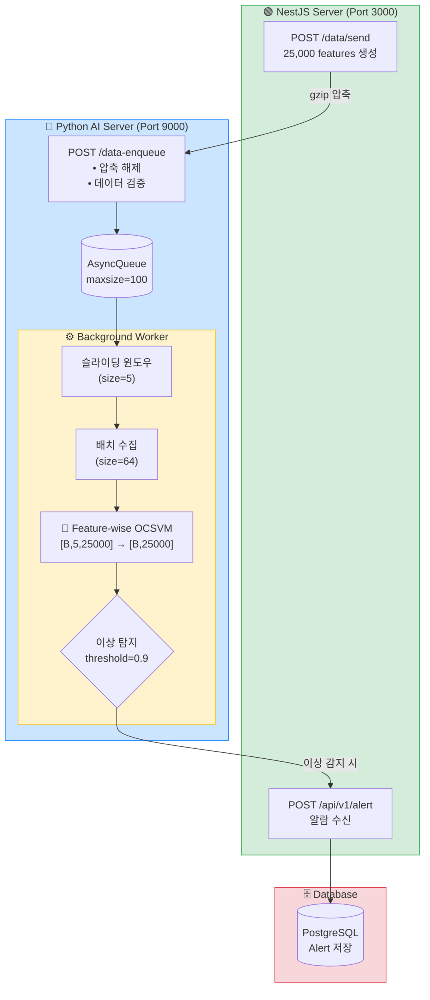
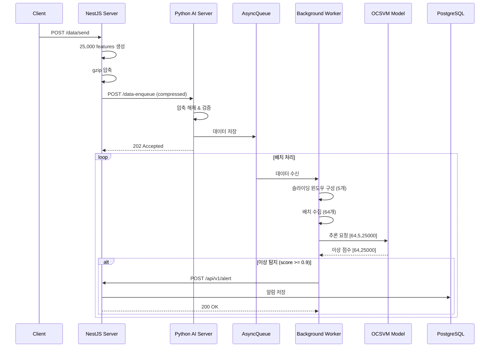

# 🔍 Real-time Anomaly Detection System

실시간 시계열 데이터 이상 탐지 시스템입니다. 25,000개 feature를 가진 시계열 데이터를 수신하여 Feature-wise One-Class SVM 모델로 이상을 탐지하고 알람을 전송합니다.

## 📁 프로젝트 구조

```
├── python-server/          # Python AI 추론 서버 (FastAPI)
│   ├── main.py             # FastAPI 애플리케이션 엔트리포인트
│   ├── ai/                 # AI 모델 관련
│   │   ├── model.py        # 모델 클래스 (DummyModel, FeatureWiseOCSVM)
│   │   └── models/         # 학습된 모델 파일
│   │       ├── featurewise_ocsvm_unified.pth
│   │       └── featurewise_ocsvm_metadata.json
│   ├── config/
│   │   └── settings.py     # 환경 설정 (pydantic-settings)
│   ├── core/
│   │   ├── message_queue.py  # 비동기 메시지 큐
│   │   ├── notifier.py       # NestJS 알람 전송
│   │   └── backoff.py        # 재시도 로직 (Exponential Backoff)
│   └── processors/
│       ├── worker.py         # 배치 추론 워커
│       └── resource_check.py # GPU/CPU 리소스 모니터링
│
└── nestjs-server/          # NestJS 백엔드 서버
    └── src/
        ├── main.ts         # NestJS 애플리케이션 엔트리포인트
        ├── data/           # 데이터 생성 및 전송 모듈
        └── alert/          # 알람 수신 및 DB 저장 모듈
```

## 🏗️ 시스템 아키텍처



### 시퀀스 다이어그램



## 🧠 AI 모델

### Feature-wise Linear One-Class SVM

- **입력**: `[batch, window_size(5), n_features(25000)]`
- **출력**: `[batch, n_features(25000)]` - 각 feature별 이상 점수
- **구조**: 25,000개의 독립적인 Linear One-Class SVM 모델
- **학습 데이터**: 정상 데이터 4,496 샘플로 학습

```python
# 추론 예시
x = torch.randn(64, 5, 25000)  # [batch, window, features]
scores = model.predict(x)       # [batch, features] - 이상 점수
```

## ⚙️ 설정

### Python Server (`config/settings.py`)

| 환경 변수 | 기본값 | 설명 |
|-----------|--------|------|
| `APP_HOST` | `0.0.0.0` | FastAPI 서버 호스트 |
| `APP_PORT` | `9000` | FastAPI 서버 포트 |
| `NESTJS_URL` | `http://localhost:3000` | NestJS 서버 URL |
| `NESTJS_ANOMALY_ENDPOINT` | `/api/v1/alert` | 알람 엔드포인트 |
| `QUEUE_MAX_SIZE` | `100` | 메시지 큐 최대 크기 |
| `INFERENCE_BATCH_SIZE` | `64` | 배치 추론 크기 |
| `DEFAULT_MODEL_NAME` | `featurewise_ocsvm` | 사용할 모델 |
| `DEFAULT_DEVICE` | `auto` | 디바이스 (`auto`, `cuda`, `cpu`) |
| `MAX_RETRIES` | `5` | 재시도 횟수 |

## 🚀 실행 방법

### 1. Python AI Server

```bash
cd python-server

# 가상환경 생성 및 활성화
python -m venv venv
source venv/bin/activate  # Windows: venv\Scripts\activate

# 의존성 설치
pip install fastapi uvicorn torch numpy httpx pydantic-settings python-json-logger pynvml psutil

# 서버 실행
uvicorn main:app --host 0.0.0.0 --port 9000
```

### 2. NestJS Server

```bash
cd nestjs-server

# 의존성 설치
npm install

# 개발 모드 실행
npm run start:dev

# 프로덕션 빌드 및 실행
npm run build
npm run start:prod
```

## 📡 API 엔드포인트

### Python AI Server (Port 9000)

| Method | Endpoint | 설명 |
|--------|----------|------|
| `POST` | `/data-enqueue` | gzip 압축된 시계열 데이터 수신 |
| `GET` | `/health/live` | Liveness 체크 |
| `GET` | `/health/ready` | Readiness 체크 (모델 로드 상태, GPU 가용성) |

### NestJS Server (Port 3000)

| Method | Endpoint | 설명 |
|--------|----------|------|
| `POST` | `/data/send` | 테스트 데이터 생성 및 AI 서버로 전송 |
| `POST` | `/api/v1/alert` | AI 서버로부터 이상 알람 수신 |

## 📊 데이터 흐름

1. **데이터 생성**: NestJS에서 25,000개 feature 데이터 생성
2. **압축 전송**: gzip 압축 후 Python 서버로 전송
3. **큐잉**: 비동기 큐에 데이터 저장
4. **윈도우 구성**: 슬라이딩 윈도우 (크기 5)로 시계열 구성
5. **배치 수집**: 64개 윈도우 수집
6. **모델 추론**: Feature-wise OCSVM으로 이상 점수 계산
7. **이상 탐지**: threshold (0.9) 초과 시 이상으로 판단
8. **알람 전송**: NestJS로 이상 feature 정보 전송
9. **DB 저장**: PostgreSQL에 알람 기록

## 🔧 주요 기능

### 배치 추론 최적화
- GPU 가속 지원 (CUDA)
- 배치 단위 추론으로 throughput 최적화
- ThreadPoolExecutor를 통한 비동기 추론

### 재시도 로직
- Exponential Backoff 적용
- 네트워크 오류 및 5xx 에러 시 자동 재시도

### 리소스 모니터링
- GPU: VRAM 사용률, GPU 연산 사용률 (pynvml)
- CPU: RAM 사용률, CPU 사용률 (psutil)

### 로깅
- JSON 형식 구조화 로깅
- 추론 latency, 배치 크기, 이상 feature 수 등 메트릭 기록

## 📦 기술 스택

### Python AI Server
- **Framework**: FastAPI
- **ML**: PyTorch
- **Async**: asyncio, httpx
- **Config**: pydantic-settings
- **Monitoring**: pynvml, psutil
- **Logging**: python-json-logger

### NestJS Server
- **Framework**: NestJS 11
- **ORM**: TypeORM
- **Database**: PostgreSQL
- **HTTP Client**: axios, axios-retry
- **Validation**: class-validator, class-transformer

## 📝 라이선스

This project is UNLICENSED.
