# 🔍 Real-time Anomaly Detection System

실시간 시계열 데이터 이상 탐지 시스템입니다. 25,000개 feature를 가진 시계열 데이터를 수신하여 Feature-wise One-Class SVM 모델로 이상을 탐지하고 알람을 전송합니다.


<details>
<summary><h2>📋 요구사항 명세서 (클릭하여 펼치기)</h2></summary>

### 1. 개요 (Overview)

본 문서는 제조 현장의 센서 데이터(온도, 진동 등)를 수집하는 **NestJS(Main Server)** 와 이를 분석하여 이상 징후를 탐지하는 **Python FastAPI(AI Engine)** 간의 연동 규격을 정의한다.

---

### 2. 시스템 아키텍처 (Architecture)

| 항목 | 규격 |
|------|------|
| **통신 프로토콜** | HTTP/1.1 (REST API) |
| **통신 패턴** | 비동기 Webhook |
| **데이터 포맷** | JSON (`Content-Type: application/json`) |

#### 통신 방향
- **Forward**: NestJS → Python (데이터 전송, 응답 대기 X)
- **Backward**: Python → NestJS (이상 감지 시에만 호출)

---

### 3. 핵심 요구사항 (Functional Requirements)

#### 3.1. 데이터 전송 (NestJS → Python)

| 항목 | 요구사항 |
|------|----------|
| **주기** | 1초 |
| **용량** | 최대 500KB |
| **데이터 구조** | 약 25,000개의 Key-Value Pair |
| **엔드포인트** | `POST /data-enqueue` |
| **응답 처리** | Python 서버는 데이터를 메모리 큐(Queue)에 적재 후 즉시 `202 Accepted` 반환 (Blocking 방지) |
| **검증** | 데이터 타입 및 구조 검증 필요 |

#### 3.2. AI 모델 관리 (Model Serving)

##### 모델 프리로딩 (Pre-loading)
- ✅ 서버 시작(Startup) 시점에 모델을 GPU/CPU 메모리에 로드
- ✅ 로드 실패 시 서버 구동 자체를 차단하거나 에러 상태로 기동

##### 배치 처리 (Batching)
- ✅ 1초에 한 번 들어오는 25,000개 데이터를 그대로 처리하거나, 내부 큐에서 일정량(예: 64 프레임)이 찼을 때 `model.predict()` 실행
- ✅ 배치 크기 옵션 처리 (`INFERENCE_BATCH_SIZE` 환경 변수)

#### 3.3. 결과 피드백 (Python → NestJS)

| 항목 | 요구사항 |
|------|----------|
| **조건** | AI 추론 결과가 설정된 임계치(Threshold)를 초과하여 '이상(Anomaly)'으로 판단될 경우에만 전송 |
| **엔드포인트** | `POST {NEST_HOST}/api/v1/alert` (NestJS 측 구현) |
| **재시도 전략** | NestJS 서버 일시 장애를 대비해 HTTP 호출 실패 시 1~5회 재시도 (Exponential Backoff) |

---

### 4. 안정성 및 운영 요구사항 (Reliability & Ops)

#### 4.1. 헬스 체크 (Health Check)

| Probe | 엔드포인트 | 목적 | 응답 |
|-------|-----------|------|------|
| **Liveness** | `GET /health/live` | 서버 프로세스가 떠 있는가? | `200 OK` (가벼운 로직) |
| **Readiness** | `GET /health/ready` | AI 모델이 로드되어 추론 가능한가? | 준비 완료: `200 OK`, 로딩 중: `503 Service Unavailable` |

##### Readiness 체크 로직
- 모델 변수가 `None`이 아닌지 확인
- GPU 연결 상태 확인

#### 4.2. 로깅 및 모니터링 (Observability)

> 단순 텍스트 로그가 아닌 **JSON 구조화 로그(Structured Logging)** 사용 (추후 ELK 등에서 분석)

##### 필수 기록 항목

| 항목 | 설명 | 구현 상태 |
|------|------|-----------|
| **Latency** | 데이터 수신 ~ 추론 완료까지 걸린 시간 (ms 단위) | ✅ |
| **Input/Output** | 이상 감지 시, 당시의 입력 데이터 ID(Timestamp)와 추론 스코어 | ✅ |
| **Resource** | 추론 시점의 CPU/GPU 메모리 점유율 | ✅ |
| **Error** | 데이터 파싱 에러, 모델 연산 에러 등 Exception Traceback | ✅ |

</details>

## 📁 프로젝트 구조

```
├── python-server/          # Python AI 추론 서버 (FastAPI)
│   ├── main.py             # FastAPI 애플리케이션 엔트리포인트
│   ├── ai/                 # AI 모델 관련
│   │   ├── model.py        # 모델 클래스 (DummyModel, FeatureWiseOCSVM)
│   │   └── models/         # 학습된 모델 파일
│   │       ├── featurewise_ocsvm_unified.pth
│   │       └── featurewise_ocsvm_metadata.json
│   ├── config/
│   │   └── settings.py     # 환경 설정 (pydantic-settings)
│   ├── core/
│   │   ├── message_queue.py  # 비동기 메시지 큐
│   │   ├── notifier.py       # NestJS 알람 전송
│   │   └── backoff.py        # 재시도 로직 (Exponential Backoff)
│   └── processors/
│       ├── worker.py         # 배치 추론 워커
│       └── resource_check.py # GPU/CPU 리소스 모니터링
│
└── nestjs-server/          # NestJS 백엔드 서버
    └── src/
        ├── main.ts         # NestJS 애플리케이션 엔트리포인트
        ├── data/           # 데이터 생성 및 전송 모듈
        └── alert/          # 알람 수신 및 DB 저장 모듈
```

## 🏗️ 시스템 아키텍처

```mermaid
flowchart TB
    subgraph NestJS["🟢 NestJS Server (Port 3000)"]
        DataController["POST /data/send<br/>25,000 features 생성"]
        AlertController["POST /api/v1/alert<br/>알람 수신"]
    end

    subgraph Python["🔵 Python AI Server (Port 9000)"]
        Enqueue["POST /data-enqueue<br/>• 압축 해제<br/>• 데이터 검증"]
        Queue[("AsyncQueue<br/>maxsize=100")]
        
        subgraph Worker["⚙️ Background Worker"]
            Window["슬라이딩 윈도우<br/>(size=5)"]
            Batch["배치 수집<br/>(size=64)"]
            Model["🧠 Feature-wise OCSVM<br/>[B,5,25000] → [B,25000]"]
            Detect{"이상 탐지<br/>threshold=0.9"}
        end
    end

    subgraph DB["🗄️ Database"]
        PostgreSQL[(PostgreSQL<br/>Alert 저장)]
    end

    DataController -->|"gzip 압축"| Enqueue
    Enqueue --> Queue
    Queue --> Window
    Window --> Batch
    Batch --> Model
    Model --> Detect
    Detect -->|"이상 감지 시"| AlertController
    AlertController --> PostgreSQL

    style NestJS fill:#d4edda,stroke:#28a745
    style Python fill:#cce5ff,stroke:#007bff
    style Worker fill:#fff3cd,stroke:#ffc107
    style DB fill:#f8d7da,stroke:#dc3545
```



### 시퀀스 다이어그램

```mermaid
sequenceDiagram
    participant Client
    participant NestJS as NestJS Server
    participant Python as Python AI Server
    participant Queue as AsyncQueue
    participant Worker as Background Worker
    participant Model as OCSVM Model
    participant DB as PostgreSQL

    Client->>NestJS: POST /data/send
    NestJS->>NestJS: 25,000 features 생성
    NestJS->>NestJS: gzip 압축
    NestJS->>Python: POST /data-enqueue (compressed)
    Python->>Python: 압축 해제 & 검증
    Python->>Queue: 데이터 저장
    Python-->>NestJS: 202 Accepted

    loop 배치 처리
        Queue->>Worker: 데이터 수신
        Worker->>Worker: 슬라이딩 윈도우 구성 (5개)
        Worker->>Worker: 배치 수집 (64개)
        Worker->>Model: 추론 요청 [64,5,25000]
        Model-->>Worker: 이상 점수 [64,25000]
        
        alt 이상 탐지 (score >= 0.9)
            Worker->>NestJS: POST /api/v1/alert
            NestJS->>DB: 알람 저장
            NestJS-->>Worker: 200 OK
        end
    end
```



## 🧠 AI 모델

### Feature-wise Linear One-Class SVM

- **입력**: `[batch, window_size(5), n_features(25000)]`
- **출력**: `[batch, n_features(25000)]` - 각 feature별 이상 점수
- **구조**: 25,000개의 독립적인 Linear One-Class SVM 모델

```python
# 추론 예시
x = torch.randn(64, 5, 25000)  # [batch, window, features]
scores = model.predict(x)       # [batch, features] - 이상 점수
```

## ⚙️ 설정

### Python Server (`config/settings.py`)

| 환경 변수 | 기본값 | 설명 |
|-----------|--------|------|
| `APP_HOST` | `0.0.0.0` | FastAPI 서버 호스트 |
| `APP_PORT` | `9000` | FastAPI 서버 포트 |
| `NESTJS_URL` | `http://localhost:3000` | NestJS 서버 URL |
| `NESTJS_ANOMALY_ENDPOINT` | `/api/v1/alert` | 알람 엔드포인트 |
| `QUEUE_MAX_SIZE` | `100` | 메시지 큐 최대 크기 |
| `INFERENCE_BATCH_SIZE` | `64` | 배치 추론 크기 |
| `DEFAULT_MODEL_NAME` | `featurewise_ocsvm` | 사용할 모델 |
| `DEFAULT_DEVICE` | `auto` | 디바이스 (`auto`, `cuda`, `cpu`) |
| `MAX_RETRIES` | `5` | 재시도 횟수 |

## 🚀 실행 방법

### 1. Python AI Server

```bash
cd python-server

# 가상환경 생성 및 활성화
python -m venv venv
source venv/bin/activate  # Windows: venv\Scripts\activate

# 의존성 설치
pip install fastapi uvicorn torch numpy httpx pydantic-settings python-json-logger pynvml psutil

# 서버 실행
uvicorn main:app --host 0.0.0.0 --port 9000
```

### 2. NestJS Server

```bash
cd nestjs-server

# 의존성 설치
npm install

# 개발 모드 실행
npm run start:dev

# 프로덕션 빌드 및 실행
npm run build
npm run start:prod
```

## 📡 API 엔드포인트

### Python AI Server (Port 9000)

| Method | Endpoint | 설명 |
|--------|----------|------|
| `POST` | `/data-enqueue` | gzip 압축된 시계열 데이터 수신 |
| `GET` | `/health/live` | Liveness 체크 |
| `GET` | `/health/ready` | Readiness 체크 (모델 로드 상태, GPU 가용성) |

### NestJS Server (Port 3000)

| Method | Endpoint | 설명 |
|--------|----------|------|
| `POST` | `/data/send` | 테스트 데이터 생성 및 AI 서버로 전송 |
| `POST` | `/api/v1/alert` | AI 서버로부터 이상 알람 수신 |

## 📊 데이터 흐름

1. **데이터 생성**: NestJS에서 25,000개 feature 데이터 생성
2. **압축 전송**: gzip 압축 후 Python 서버로 전송
3. **큐잉**: 비동기 큐에 데이터 저장
4. **윈도우 구성**: 슬라이딩 윈도우 (크기 5)로 시계열 구성
5. **배치 수집**: 64개 윈도우 수집
6. **모델 추론**: Feature-wise OCSVM으로 이상 점수 계산
7. **이상 탐지**: threshold (0.9) 초과 시 이상으로 판단
8. **알람 전송**: NestJS로 이상 feature 정보 전송
9. **DB 저장**: PostgreSQL에 알람 기록

## 🔧 주요 기능

### 배치 추론 최적화
- GPU 가속 지원 (CUDA)
- 배치 단위 추론으로 throughput 최적화
- ThreadPoolExecutor를 통한 비동기 추론

### 재시도 로직
- Exponential Backoff 적용
- 네트워크 오류 및 5xx 에러 시 자동 재시도

### 리소스 모니터링
- GPU: VRAM 사용률, GPU 연산 사용률 (pynvml)
- CPU: RAM 사용률, CPU 사용률 (psutil)

### 로깅
- JSON 형식 구조화 로깅
- 추론 latency, 배치 크기, 이상 feature 수 등 메트릭 기록

## 📦 기술 스택

### Python AI Server
- **Framework**: FastAPI
- **ML**: PyTorch
- **Async**: asyncio, httpx
- **Config**: pydantic-settings
- **Monitoring**: pynvml, psutil
- **Logging**: python-json-logger

### NestJS Server
- **Framework**: NestJS 11
- **ORM**: TypeORM
- **Database**: PostgreSQL
- **HTTP Client**: axios, axios-retry
- **Validation**: class-validator, class-transformer

## 📝 라이선스

This project is UNLICENSED.
