# 🔍 Real-time Anomaly Detection System

A real-time time-series data anomaly detection system. It receives time-series data with 25,000 features, detects anomalies using a Feature-wise One-Class SVM model, and sends alerts.


<details>
<summary><h2>📋 Requirements Specification (Click to expand)</h2></summary>

### 1. Overview

This document defines the integration specifications between **NestJS (Main Server)**, which collects sensor data (temperature, vibration, etc.) from manufacturing sites, and **Python FastAPI (AI Engine)**, which analyzes this data to detect anomalies.

---

### 2. System Architecture

| Item | Specification |
|------|---------------|
| **Communication Protocol** | HTTP/1.1 (REST API) |
| **Communication Pattern** | Asynchronous Webhook |
| **Data Format** | JSON (`Content-Type: application/json`) |

#### Communication Direction
- **Forward**: NestJS → Python (Data transmission, no response waiting)
- **Backward**: Python → NestJS (Called only when anomaly detected)

---

### 3. Functional Requirements

#### 3.1. Data Transmission (NestJS → Python)

| Item | Requirement |
|------|-------------|
| **Interval** | 1 second |
| **Size** | Max 500KB |
| **Data Structure** | Approximately 25,000 Key-Value Pairs |
| **Endpoint** | `POST /data-enqueue` |
| **Response Handling** | Python server loads data into memory queue and immediately returns `202 Accepted` (Blocking prevention) |
| **Validation** | Data type and structure validation required |

#### 3.2. AI Model Management (Model Serving)

##### Model Pre-loading
- ✅ Load model into GPU/CPU memory at server startup
- ✅ Block server startup or start in error state if loading fails

##### Batch Processing
- ✅ Process 25,000 data points arriving every second as-is, or execute `model.predict()` when internal queue reaches a certain amount (e.g., 64 frames)
- ✅ Batch size option handling (`INFERENCE_BATCH_SIZE` environment variable)

#### 3.3. Result Feedback (Python → NestJS)

| Item | Requirement |
|------|-------------|
| **Condition** | Send only when AI inference result exceeds configured threshold and is judged as 'Anomaly' |
| **Endpoint** | `POST {NEST_HOST}/api/v1/alert` (Implemented on NestJS side) |
| **Retry Strategy** | 1-5 retries with Exponential Backoff on HTTP call failure to handle temporary NestJS server failures |

---

### 4. Reliability & Operations Requirements

#### 4.1. Health Check

| Probe | Endpoint | Purpose | Response |
|-------|----------|---------|----------|
| **Liveness** | `GET /health/live` | Is the server process running? | `200 OK` (Lightweight logic) |
| **Readiness** | `GET /health/ready` | Is the AI model loaded and ready for inference? | Ready: `200 OK`, Loading: `503 Service Unavailable` |

##### Readiness Check Logic
- Verify model variable is not `None`
- Check GPU connection status

#### 4.2. Logging & Monitoring (Observability)

> Use **JSON Structured Logging** instead of plain text logs (for analysis in ELK, etc.)

##### Required Log Items

| Item | Description | Implementation Status |
|------|-------------|----------------------|
| **Latency** | Time from data reception to inference completion (in ms) | ✅ |
| **Input/Output** | Input data ID (Timestamp) and inference score when anomaly detected | ✅ |
| **Resource** | CPU/GPU memory utilization at inference time | ✅ |
| **Error** | Exception Traceback for data parsing errors, model computation errors, etc. | ✅ |

</details>

## 📁 Project Structure

```
├── python-server/          # Python AI Inference Server (FastAPI)
│   ├── main.py             # FastAPI application entrypoint
│   ├── ai/                 # AI model related
│   │   ├── model.py        # Model classes (DummyModel, FeatureWiseOCSVM)
│   │   └── models/         # Trained model files
│   │       ├── featurewise_ocsvm_unified.pth
│   │       └── featurewise_ocsvm_metadata.json
│   ├── config/
│   │   └── settings.py     # Configuration (pydantic-settings)
│   ├── core/
│   │   ├── message_queue.py  # Async message queue
│   │   ├── notifier.py       # NestJS alert sender
│   │   └── backoff.py        # Retry logic (Exponential Backoff)
│   └── processors/
│       ├── worker.py         # Batch inference worker
│       └── resource_check.py # GPU/CPU resource monitoring
│
└── nestjs-server/          # NestJS Backend Server
    └── src/
        ├── main.ts         # NestJS application entrypoint
        ├── data/           # Data generation and transmission module
        └── alert/          # Alert reception and DB storage module
```

## 🏗️ System Architecture

```mermaid
flowchart TB
    subgraph NestJS["🟢 NestJS Server (Port 3000)"]
        DataController["POST /data/send<br/>Generate 25,000 features"]
        AlertController["POST /api/v1/alert<br/>Receive alerts"]
    end

    subgraph Python["🔵 Python AI Server (Port 9000)"]
        Enqueue["POST /data-enqueue<br/>• Decompress<br/>• Validate data"]
        Queue[("AsyncQueue<br/>maxsize=100")]
        
        subgraph Worker["⚙️ Background Worker"]
            Window["Sliding Window<br/>(size=5)"]
            Batch["Batch Collection<br/>(size=64)"]
            Model["🧠 Feature-wise OCSVM<br/>[B,5,25000] → [B,25000]"]
            Detect{"Anomaly Detection<br/>threshold=0.9"}
        end
    end

    subgraph DB["🗄️ Database"]
        PostgreSQL[(PostgreSQL<br/>Store Alerts)]
    end

    DataController -->|"gzip compression"| Enqueue
    Enqueue --> Queue
    Queue --> Window
    Window --> Batch
    Batch --> Model
    Model --> Detect
    Detect -->|"On anomaly detected"| AlertController
    AlertController --> PostgreSQL

    style NestJS fill:#d4edda,stroke:#28a745
    style Python fill:#cce5ff,stroke:#007bff
    style Worker fill:#fff3cd,stroke:#ffc107
    style DB fill:#f8d7da,stroke:#dc3545
```



### Sequence Diagram


## 🧠 AI Model

### Feature-wise Linear One-Class SVM

- **Input**: `[batch, window_size(5), n_features(25000)]`
- **Output**: `[batch, n_features(25000)]` - Anomaly score per feature
- **Structure**: 25,000 independent Linear One-Class SVM models

```python
# Inference example
x = torch.randn(64, 5, 25000)  # [batch, window, features]
scores = model.predict(x)       # [batch, features] - anomaly scores
```

## ⚙️ Configuration

### Python Server (`config/settings.py`)

| Environment Variable | Default | Description |
|---------------------|---------|-------------|
| `APP_HOST` | `0.0.0.0` | FastAPI server host |
| `APP_PORT` | `9000` | FastAPI server port |
| `NESTJS_URL` | `http://localhost:3000` | NestJS server URL |
| `NESTJS_ANOMALY_ENDPOINT` | `/api/v1/alert` | Alert endpoint |
| `QUEUE_MAX_SIZE` | `100` | Max message queue size |
| `INFERENCE_BATCH_SIZE` | `64` | Batch inference size |
| `DEFAULT_MODEL_NAME` | `featurewise_ocsvm` | Model to use |
| `DEFAULT_DEVICE` | `auto` | Device (`auto`, `cuda`, `cpu`) |
| `MAX_RETRIES` | `5` | Number of retries |

## 🚀 Getting Started

### 1. Python AI Server

```bash
cd python-server

# Create and activate virtual environment
python -m venv venv
source venv/bin/activate  # Windows: venv\Scripts\activate

# Install dependencies
pip install fastapi uvicorn torch numpy httpx pydantic-settings python-json-logger pynvml psutil

# Run server
uvicorn main:app --host 0.0.0.0 --port 9000
```

### 2. NestJS Server

```bash
cd nestjs-server

# Install dependencies
npm install

# Run in development mode
npm run start:dev

# Build and run in production
npm run build
npm run start:prod
```

## 📡 API Endpoints

### Python AI Server (Port 9000)

| Method | Endpoint | Description |
|--------|----------|-------------|
| `POST` | `/data-enqueue` | Receive gzip-compressed time-series data |
| `GET` | `/health/live` | Liveness check |
| `GET` | `/health/ready` | Readiness check (model load status, GPU availability) |

### NestJS Server (Port 3000)

| Method | Endpoint | Description |
|--------|----------|-------------|
| `POST` | `/data/send` | Generate test data and send to AI server |
| `POST` | `/api/v1/alert` | Receive anomaly alerts from AI server |

## 📊 Data Flow

1. **Data Generation**: NestJS generates 25,000 feature data
2. **Compressed Transmission**: gzip compression and send to Python server
3. **Queuing**: Store data in async queue
4. **Window Construction**: Build time-series with sliding window (size 5)
5. **Batch Collection**: Collect 64 windows
6. **Model Inference**: Calculate anomaly scores with Feature-wise OCSVM
7. **Anomaly Detection**: Judge as anomaly if threshold (0.9) exceeded
8. **Alert Transmission**: Send anomalous feature info to NestJS
9. **DB Storage**: Record alert in PostgreSQL

## 🔧 Key Features

### Batch Inference Optimization
- GPU acceleration support (CUDA)
- Throughput optimization with batch inference
- Async inference via ThreadPoolExecutor

### Retry Logic
- Exponential Backoff applied
- Auto retry on network errors and 5xx errors

### Resource Monitoring
- GPU: VRAM utilization, GPU compute utilization (pynvml)
- CPU: RAM utilization, CPU utilization (psutil)

### Logging
- JSON structured logging
- Metrics recording: inference latency, batch size, anomaly feature count, etc.

## 📦 Tech Stack

### Python AI Server
- **Framework**: FastAPI
- **ML**: PyTorch
- **Async**: asyncio, httpx
- **Config**: pydantic-settings
- **Monitoring**: pynvml, psutil
- **Logging**: python-json-logger

### NestJS Server
- **Framework**: NestJS 11
- **ORM**: TypeORM
- **Database**: PostgreSQL
- **HTTP Client**: axios, axios-retry
- **Validation**: class-validator, class-transformer

## 📝 License

This project is UNLICENSED.
